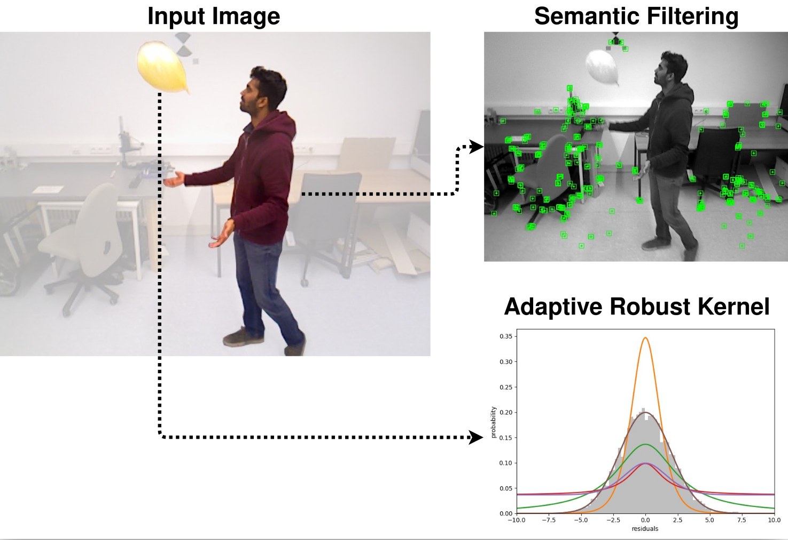

# VAR-SLAM: Visual Adaptive and Robust SLAM for Dynamic Environments

**VAR-SLAM** introduces a novel feature-based visual SLAM system designed for dynamic environments. It combines a lightweight semantic keypoint filter to deal with known moving objects, with Barron’s adaptive robust loss to handle unknown ones. An adaptive parameter α is estimated online, allowing the system to handle both static and dynamic regions effectively without extensive threshold tuning.

**The paper is available [here](https://arxiv.org/pdf/2510.16205)!!** 

  

## Code Availability

The implementation will be released publicly after the review process.
